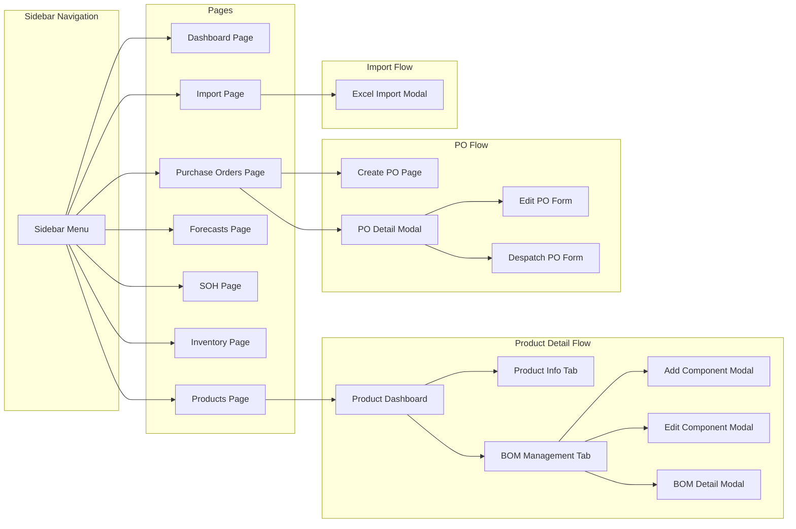

# docs/diagrams/app-flow.md

```mermaid
flowchart LR
    subgraph Sidebar Navigation
        S[Sidebar Menu]
    end

    subgraph Pages
        DASH[Dashboard Page]
        PROD[Products Page]
        PO[Purchase Orders Page]
        FC[Forecasts Page]
        SOH[SOH Page]
        INV[Inventory Page]
        IMP[Import Page]
    end

    subgraph Product Detail Flow
        PD[Product Dashboard]
        PI[Product Info Tab]
        BOM[BOM Management Tab]
        ADD_BOM[Add Component Modal]
        EDIT_BOM[Edit Component Modal]
        BOM_DETAIL[BOM Detail Modal]
    end

    subgraph PO Flow
        CREATE_PO[Create PO Page]
        PO_DETAIL[PO Detail Modal]
        EDIT_PO[Edit PO Form]
        DESP_PO[Despatch PO Form]
    end

    subgraph Import Flow
        EXCEL[Excel Import Modal]
    end

    S --> DASH
    S --> PROD
    S --> PO
    S --> FC
    S --> SOH
    S --> INV
    S --> IMP

    PROD --> PD
    PD --> PI
    PD --> BOM
    BOM --> ADD_BOM
    BOM --> EDIT_BOM
    BOM --> BOM_DETAIL

    PO --> CREATE_PO
    PO --> PO_DETAIL
    PO_DETAIL --> EDIT_PO
    PO_DETAIL --> DESP_PO

    IMP --> EXCEL
```