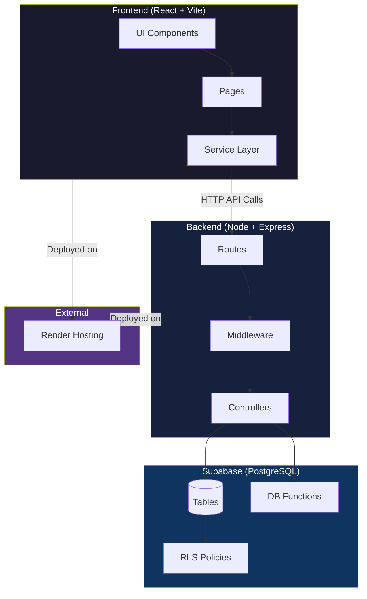

# docs/diagrams/architecture.md

```mermaid
flowchart TB
    subgraph Frontend ["Frontend (React + Vite)"]
        UI[UI Components]
        PAGES[Pages]
        SERVICES[Service Layer]
    end

    subgraph Backend ["Backend (Node + Express)"]
        ROUTES[Routes]
        CONTROLLERS[Controllers]
        MIDDLEWARE[Middleware]
    end

    subgraph Database ["Supabase (PostgreSQL)"]
        TABLES[(Tables)]
        FUNCTIONS[DB Functions]
        RLS[RLS Policies]
    end

    subgraph External ["External"]
        RENDER[Render Hosting]
    end

    UI --> PAGES
    PAGES --> SERVICES
    SERVICES -->|HTTP API Calls| ROUTES
    ROUTES --> MIDDLEWARE
    MIDDLEWARE --> CONTROLLERS
    CONTROLLERS --> TABLES
    CONTROLLERS --> FUNCTIONS
    TABLES --> RLS

    Frontend -->|Deployed on| RENDER
    Backend -->|Deployed on| RENDER

    style Frontend fill:#1a1a2e,color:#fff
    style Backend fill:#16213e,color:#fff
    style Database fill:#0f3460,color:#fff
    style External fill:#533483,color:#fff
```